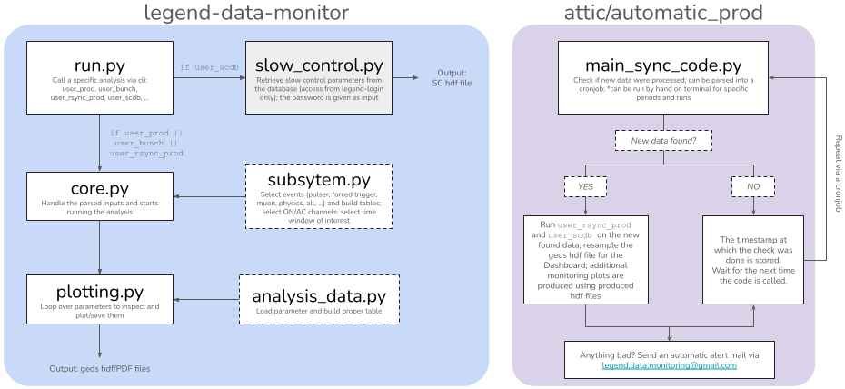

Potpourri
=========

Flowchart of the anaysis
------------------------

How to build runinfo.yaml
-------------------------

You can build the .yaml file containing all run summary information (start/end timestamps, livetime in seconds) using the following command:

.. code-block:: bash

  $ legend-data-monitor get_runinfo --path /global/cfs/cdirs/m2676/data/lngs/l200/public/prodenv/prod-blind --output output/ --data_version tmp-auto

How to evaluate exposure
------------------------

You can extract the exposure using the following command:

.. code-block:: bash

  $ legend-data-monitor get_exposure --period p03 --run r000 r001 r002 --runinfo_path output/runinfo.yaml --path /global/cfs/cdirs/m2676/data/lngs/l200/public/prodenv/prod-blind --data_version tmp-auto
